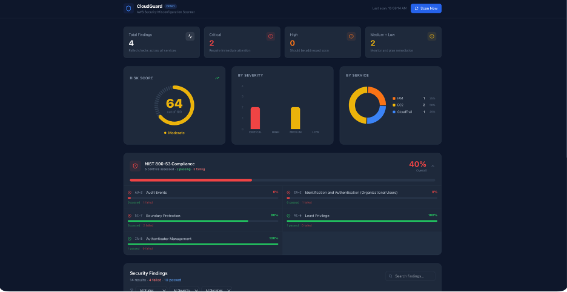
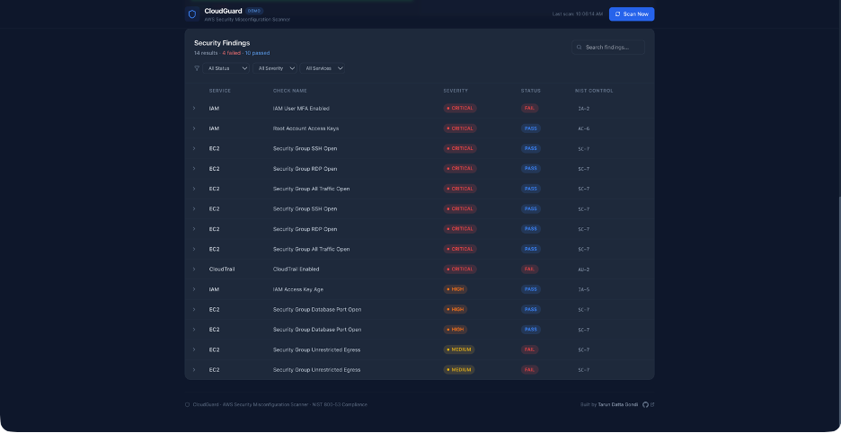
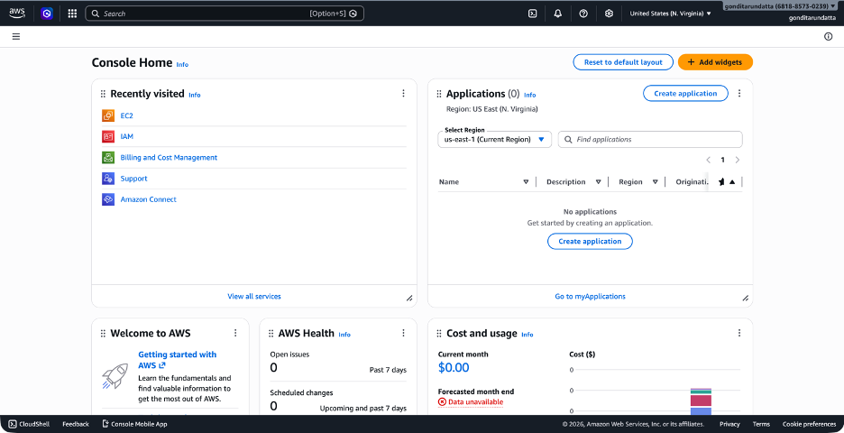

# CloudGuard

AWS Security Misconfiguration Scanner and Risk Dashboard that automates security auditing across five AWS services, maps findings to NIST 800-53 compliance controls, and displays results in a real-time risk dashboard.

---

## What CloudGuard Does

AWS accounts have hundreds of configurable settings across storage, identity, networking, logging, and databases. A single misconfiguration -- a publicly accessible S3 bucket, an IAM user without MFA, or a security group with SSH open to the internet -- can expose sensitive data, allow unauthorized access, or leave no audit trail for forensic analysis. Most teams do not discover these issues until after a breach or a failed compliance audit.

CloudGuard solves this by scanning an AWS account for common security misconfigurations across five core services. Each finding is mapped to a specific NIST 800-53 compliance control, assigned a severity level based on potential impact, and presented in a visual dashboard with clear remediation guidance. The result is a single view of an account's security posture with actionable steps to fix every issue found.



## How Security Scanning Works

CloudGuard follows a straightforward scanning pipeline:

1. **Connect** -- CloudGuard connects to an AWS account using boto3 (the AWS SDK for Python) with read-only credentials. No write permissions are required.
2. **Scan** -- Five specialized scanner modules execute in sequence, one per AWS service. Each scanner calls the relevant AWS APIs to inspect resource configurations.
3. **Evaluate** -- Each scanner checks specific settings against security best practices. For example, the S3 scanner checks whether Block Public Access is enabled, and the IAM scanner checks whether every user has MFA configured.
4. **Map** -- Every finding is mapped to the relevant NIST 800-53 control (e.g., missing MFA maps to IA-2: Identification and Authentication) and assigned a severity level: Critical, High, Medium, or Low.
5. **Serve** -- Results are served through a FastAPI REST API as structured JSON, with endpoints for full scans, per-service scans, aggregated summaries, and NIST control mappings.
6. **Display** -- A React dashboard consumes the API and presents findings through charts, tables, a risk score gauge, and a compliance breakdown with remediation steps for every failed check.

---

## Security Checks by Service

CloudGuard performs 22 distinct security checks across five AWS services.



### S3 (Storage)

| Check | What It Detects | Severity | NIST Control |
|-------|----------------|----------|--------------|
| Public Access | Block Public Access settings disabled, allowing public ACLs or bucket policies | Critical | AC-3 |
| Default Encryption | Server-side encryption not enabled, leaving objects unencrypted at rest | High | SC-13 |
| Versioning | Bucket versioning not enabled, risking permanent data loss from accidental deletions | Medium | CP-9 |
| Access Logging | Server access logging not enabled, leaving no record of object-level access | Low | AU-2 |

### IAM (Identity and Access Management)

| Check | What It Detects | Severity | NIST Control |
|-------|----------------|----------|--------------|
| MFA Not Enabled | IAM users without any MFA device configured | Critical | IA-2 |
| Overly Permissive Policy | Customer-managed policies with Effect:Allow, Action:\*, Resource:\* granting full account access | Critical | AC-6 |
| Access Key Age | Active access keys older than 90 days that have not been rotated | High | IA-5 |
| Inactive Users | Users with no console login in 90+ days but account still active | Medium | AC-2 |
| Root Access Keys | Root account has active access keys, providing unrestricted and unscopeable access | Critical | AC-6 |

### Security Groups (Network Firewall)

| Check | What It Detects | Severity | NIST Control |
|-------|----------------|----------|--------------|
| SSH Open to Internet | Port 22 (SSH) allows inbound traffic from 0.0.0.0/0 or ::/0 | Critical | SC-7 |
| RDP Open to Internet | Port 3389 (RDP) allows inbound traffic from 0.0.0.0/0 or ::/0 | Critical | SC-7 |
| All Traffic Open | All ports and protocols allow inbound traffic from 0.0.0.0/0 | Critical | SC-7 |
| Database Ports Exposed | MySQL (3306), PostgreSQL (5432), MSSQL (1433), or MongoDB (27017) open to 0.0.0.0/0 | High | SC-7 |
| Unrestricted Egress | All outbound traffic allowed to 0.0.0.0/0 on all ports | Medium | SC-7 |

### CloudTrail (Audit Logging)

| Check | What It Detects | Severity | NIST Control |
|-------|----------------|----------|--------------|
| Trail Not Enabled | No CloudTrail trails configured in the account | Critical | AU-2 |
| No Multi-Region Trail | Trail does not capture API activity in all AWS regions | High | AU-2 |
| Log File Validation Disabled | Log file integrity validation not enabled, making tampering undetectable | Medium | AU-10 |
| Logs Not Encrypted | CloudTrail logs not encrypted with a KMS key | High | SC-13 |

### RDS (Databases)

| Check | What It Detects | Severity | NIST Control |
|-------|----------------|----------|--------------|
| Publicly Accessible | RDS instance endpoint is reachable from the internet | Critical | AC-3 |
| Storage Not Encrypted | Database storage encryption not enabled, leaving data at rest unprotected | High | SC-28 |
| No Automated Backups | Backup retention period set to 0 days | High | CP-9 |
| No Multi-AZ | Instance not configured for Multi-AZ deployment, no availability zone failover | Medium | CP-10 |

---

## NIST 800-53 Compliance Mapping

NIST Special Publication 800-53 is a catalog of security and privacy controls published by the National Institute of Standards and Technology. It defines the security requirements for federal information systems and is mandatory for U.S. government agencies and their contractors. The framework is also widely adopted in the private sector as a baseline for security programs, particularly in healthcare, finance, and defense.

CloudGuard maps every finding to one of the following NIST 800-53 controls:

| Control | Family | Name | Description |
|---------|--------|------|-------------|
| AC-2 | Access Control | Account Management | Manage system accounts including establishing, activating, modifying, reviewing, disabling, and removing accounts |
| AC-3 | Access Control | Access Enforcement | Enforce approved authorizations for logical access to information and system resources |
| AC-6 | Access Control | Least Privilege | Allow only authorized accesses necessary to accomplish assigned tasks |
| AU-2 | Audit and Accountability | Audit Events | Identify and audit security-relevant events in the system |
| AU-10 | Audit and Accountability | Non-Repudiation | Provide irrefutable evidence that actions occurred, protecting against false denial |
| CP-9 | Contingency Planning | System Backup | Conduct backups of system-level and user-level information at defined frequency |
| CP-10 | Contingency Planning | System Recovery and Reconstitution | Recover and reconstitute the system to a known state after disruption or failure |
| IA-2 | Identification and Authentication | Identification and Authentication | Uniquely identify and authenticate users with multi-factor authentication |
| IA-5 | Identification and Authentication | Authenticator Management | Manage authenticators including credential rotation and lifecycle |
| SC-7 | System and Communications Protection | Boundary Protection | Monitor and control communications at external and key internal boundaries |
| SC-13 | System and Communications Protection | Cryptographic Protection | Implement cryptographic mechanisms to prevent unauthorized disclosure |
| SC-28 | System and Communications Protection | Protection of Information at Rest | Protect the confidentiality and integrity of stored information |

---

## Risk Scoring Methodology

CloudGuard calculates an overall risk score on a 0-100 scale. A score of 100 indicates no misconfigurations were found. The score decreases based on the number and severity of failed checks:

| Severity | Points Deducted Per Finding |
|----------|-----------------------------|
| Critical | 15 |
| High | 8 |
| Medium | 3 |
| Low | 1 |

The minimum score is 0. The formula is:

```
Risk Score = max(0, 100 - (Critical x 15) - (High x 8) - (Medium x 3) - (Low x 1))
```

**Example calculation:**

An account with 2 Critical, 3 High, and 5 Medium findings:

```
100 - (2 x 15) - (3 x 8) - (5 x 3) = 100 - 30 - 24 - 15 = 31
```

A score of 31 indicates a high-risk environment requiring immediate remediation of critical and high-severity findings.

---

## Tech Stack

| Technology | Purpose |
|------------|---------|
| Python 3.11+ | Backend language |
| FastAPI | Async REST API framework for serving scan results |
| boto3 | AWS SDK for Python, used to call AWS service APIs |
| python-dotenv | Environment variable management for credentials |
| React | Frontend UI library |
| Tailwind CSS | Utility-first CSS framework for styling |
| Recharts | Charting library for severity and service breakdown visualizations |
| Axios | HTTP client for API requests from the frontend |
| Lucide React | Icon library |

---

## Project Structure

```
CloudGuard/
├── backend/
│   ├── .env.example              # Template for environment variables
│   ├── .gitignore                # Excludes .env and __pycache__
│   ├── main.py                   # FastAPI app with all API endpoints
│   ├── requirements.txt          # Python dependencies
│   ├── models/
│   │   ├── __init__.py
│   │   └── findings.py           # Finding dataclass, Status and Severity enums
│   └── scanners/
│       ├── __init__.py
│       ├── s3_scanner.py         # S3 bucket security checks
│       ├── iam_scanner.py        # IAM user, policy, and key checks
│       ├── sg_scanner.py         # EC2 Security Group port and egress checks
│       ├── cloudtrail_scanner.py # CloudTrail configuration checks
│       └── rds_scanner.py        # RDS instance security checks
├── frontend/
│   ├── package.json              # Node.js dependencies
│   ├── tailwind.config.js        # Tailwind CSS configuration
│   ├── postcss.config.js         # PostCSS configuration
│   ├── public/
│   │   └── index.html            # HTML template
│   └── src/
│       ├── index.js              # React entry point
│       ├── index.css             # Tailwind directives and global styles
│       ├── App.js                # Root component
│       ├── api/
│       │   └── client.js         # Axios client for backend API
│       └── components/
│           ├── Dashboard.jsx     # Main dashboard with data fetching and layout
│           ├── FindingsTable.jsx # Sortable, filterable findings table
│           ├── RiskScore.jsx     # Circular risk score gauge
│           ├── SeverityChart.jsx # Bar chart of findings by severity
│           ├── ServiceBreakdown.jsx # Donut chart of findings by service
│           └── NistCompliance.jsx   # NIST control compliance progress bars
├── README.md
└── LICENSE
```

---

## API Endpoints

### GET /health

Health check endpoint.

```json
{ "status": "healthy" }
```

### GET /api/scan

Runs all five scanners and returns every finding.

```json
{
  "findings": [
    {
      "id": "uuid",
      "service": "S3",
      "check_name": "S3 Bucket Public Access",
      "status": "FAIL",
      "severity": "CRITICAL",
      "description": "Bucket 'prod-assets' has Block Public Access disabled.",
      "remediation": "Enable Block Public Access settings...",
      "nist_control": "AC-3"
    }
  ],
  "count": 22
}
```

### GET /api/scan/{service}

Runs a single scanner. Valid services: `s3`, `iam`, `sg`, `cloudtrail`, `rds`.

```json
{
  "service": "iam",
  "findings": [...],
  "count": 8
}
```

### GET /api/summary

Returns aggregated scan results with risk score and compliance data.

```json
{
  "total_findings": 22,
  "findings_by_severity": { "CRITICAL": 9, "HIGH": 7, "MEDIUM": 5, "LOW": 1 },
  "findings_by_service": { "S3": 4, "IAM": 5, "EC2": 5, "CloudTrail": 4, "RDS": 4 },
  "overall_risk_score": 0,
  "nist_compliance": {
    "controls": [
      { "control_id": "AC-2", "name": "Account Management", "passed": 0, "failed": 1, "compliance_pct": 0 }
    ],
    "overall_compliance_pct": 0
  }
}
```

### GET /api/nist-mapping

Returns the full NIST 800-53 control catalog used by CloudGuard.

```json
{
  "controls": [
    {
      "id": "AC-3",
      "family": "Access Control",
      "name": "Access Enforcement",
      "description": "Enforce approved authorizations for logical access..."
    }
  ]
}
```

---

## Quick Start

### Prerequisites

- Python 3.11 or higher
- Node.js 18 or higher
- npm

### 1. Clone the Repository

```bash
git clone https://github.com/tarundattagondi/CloudGuard.git
cd CloudGuard
```

### 2. Set Up the Backend

```bash
cd backend
pip install -r requirements.txt
cp .env.example .env
```

Edit `.env` and set `DEMO_MODE=true` for demo data, or add your AWS credentials for live scanning (see Live Scanning below).

```bash
uvicorn main:app --reload
```

The backend runs at `http://localhost:8000`.

### 3. Set Up the Frontend

Open a new terminal:

```bash
cd frontend
npm install
npm start
```

The frontend runs at `http://localhost:3000`.

### 4. Open the Dashboard

Navigate to `http://localhost:3000` in your browser.

---

## Demo Mode

CloudGuard works without AWS credentials. Set `DEMO_MODE=true` in `backend/.env` and the scanners will return realistic mock findings instead of calling AWS APIs. This allows the full dashboard to be demonstrated without a live AWS account.

Demo mode generates findings across all five services with a mix of passed and failed checks, providing a realistic view of what a production scan looks like.

To switch from demo to live scanning, change `DEMO_MODE=false` in `.env` and add valid AWS credentials. Restart the backend for changes to take effect.

---

## Live Scanning

To scan a real AWS account:

### 1. Create an IAM User

In the AWS Console, create an IAM user with programmatic access. Attach the `SecurityAudit` AWS-managed policy, which provides read-only access to security configurations across all services.

### 2. Generate Access Keys

Under the user's Security Credentials tab, create an access key pair.

### 3. Configure Credentials

Edit `backend/.env`:

```
DEMO_MODE=false
AWS_ACCESS_KEY_ID=your-access-key-id
AWS_SECRET_ACCESS_KEY=your-secret-access-key
AWS_DEFAULT_REGION=us-east-1
```

### 4. Run the Scan

Start the backend and open the dashboard. CloudGuard will scan the live AWS account and display real findings.

```bash
cd backend
uvicorn main:app --reload
```

**Note:** CloudGuard only requires read-only access. It never modifies any AWS resources.



---

## Author

Built by Tarun Datta Gondi

- GitHub: [github.com/tarundattagondi](https://github.com/tarundattagondi)
- Email: gonditarundatta@gmail.com

---

## License

This project is licensed under the MIT License. See the [LICENSE](LICENSE) file for details.
